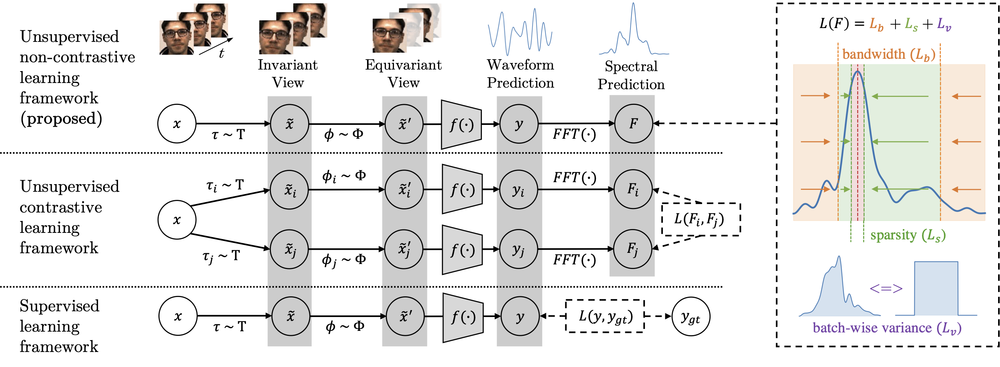

# SiNC-rPPG:
# Non-Contrastive Unsupervised Learning of Physiological Signals from Video

## Highlight paper in Conference on Computer Vision and Pattern Recognition (CVPR) 2023

### [Paper](https://openaccess.thecvf.com/content/CVPR2023/papers/Speth_Non-Contrastive_Unsupervised_Learning_of_Physiological_Signals_From_Video_CVPR_2023_paper.pdf) | [Video](https://www.youtube.com/watch?v=Bg7VkxWcOhQ)

<figure>
  
  <figcaption>Figure 1: Overview of the SiNC framework for rPPG compared with traditional supervised and unsupervised learning. Supervised and contrastive losses use distance metrics to the ground truth or other samples. Our framework applies the loss directly to the prediction by shaping the frequency spectrum, and encouraging variance over a batch of inputs. Power outside of the bandlimits is penalized to learn invariances to irrelevant frequencies. Power within the bandlimits is encouraged to be sparsely distributed near the peak frequency.</figcaption>                                                                                                          </figure>

## Contents
* Preprocessing code for the PURE dataset is in src/preprocessing/PURE
* Training code is in src/train.py
* Testing code is in src/test.py
* Experiment config file is in src/args.py
* Loss functions are in src/utils/losses.py
* Model architectures are in src/models/
* Dataloaders are in src/datasets/
* TODO: preprocessing code for UBFC-rPPG, DDPM, and HKBU-MARs.

## To Run
1.) To prepare the data for training, download PURE and follow the steps in src/preprocessing/PURE

2.) Train several models with:

``
./scripts/train_PURE.sh
``

3.) Test the models with:

``
scripts/test_PURE.sh
``

## Notes
When new dataloaders are added, make sure to add them to src/datasets/utils.py so they can be selected from a corresponding command-line argument. You can run cross-dataset experiments by adding new datasets to line 30 in src/test.py.

### Citation
If you use any part of our code or data, please cite our paper.
```
@inproceedings{speth2023sinc,
  title={Non-Contrastive Unsupervised Learning of Physiological Signals from Video},
  author={Speth, Jeremy and Vance, Nathan and Flynn, Patrick and Czajka, Adam},
  booktitle={Proceedings of the IEEE/CVF Conference on Computer Vision and Pattern Recognition (CVPR)},
  year={2023},
}
